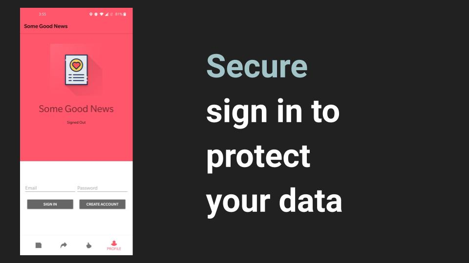
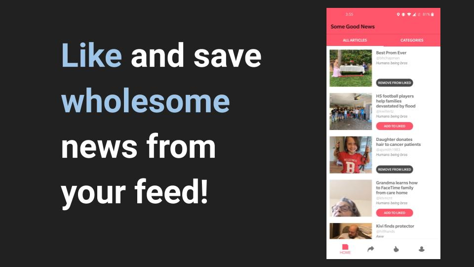
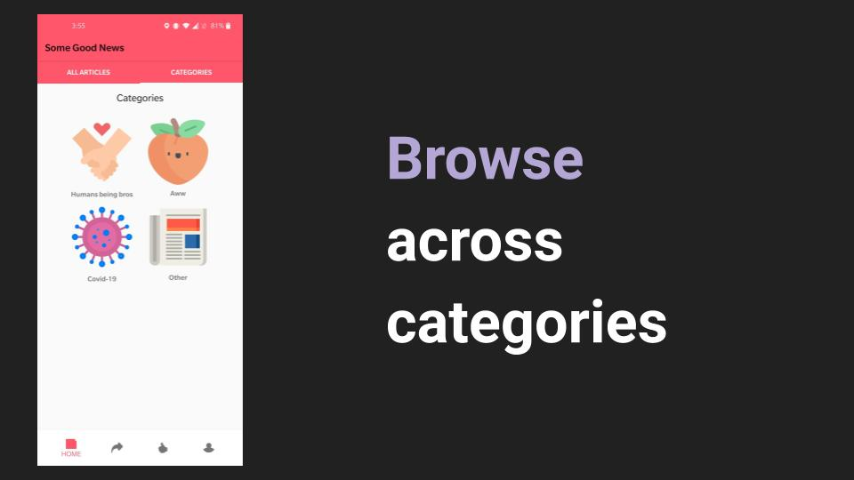
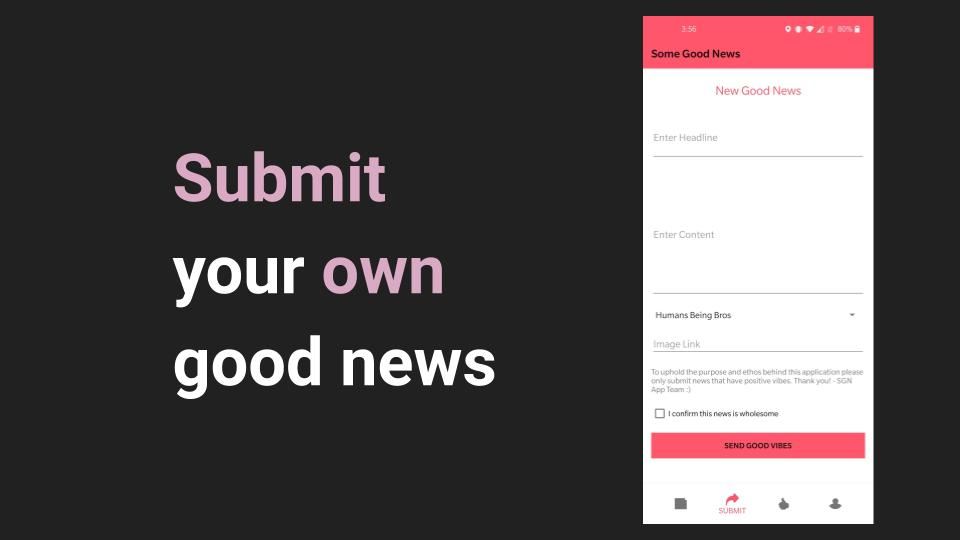

# SomeGoodNews
This past year, the whole world was thrown into an unprecedented situation.
Constantly consuming news about the pandemic can lead to excessive mental stress and fatigue.
Which is why our team, inspired by [John Krasinski's YouTube show](https://www.youtube.com/channel/UCOe_y6KKvS3PdIfb9q9pGug), **aims to bring you only good news from around the world.**
Fear and worrying are normal responses in times of uncertainty but we hope that our application will remind people that there’s still lots of things to appreciate.
This android application allows you to scroll through some wholesome news, 'like' them to save them for later, or submit your own stories to continue spreading the love!:revolving_hearts:

### Download the app [here](https://github.com/shrayarora8/SomeGoodNews/raw/master/SomeGoodNews.apk)

## Screenshots

## Features
- View a list of uplifting news stories
- Navigate through different news categories like ‘Humans being bros’, ‘Aww’, ‘Covid-19’, and ‘Other’
- Click on a news story to view the full story
- Submit positive news stories yourself
- ‘Like’ news stories that you enjoy
- View your previously liked stories and unlike them if needed
- Share wholesome stories from **SomeGoodNews** to external social media sites or messages

## Contributors
- :man:  [@shrayarora8](https://github.com/shrayarora8)
- :man:  [@ashmannsygle](https://github.com/ashmannsyngle)
- :woman:  [@rajoshich](https://github.com/rajoshich)
- :woman:  [@saashamoruw](https://github.com/saashamoruw)
- :purple_heart:  Special shoutout to [Eric Chee](https://github.com/echeeUW) for being an amazing instructor

## Upcoming features
- Receive daily notifications about the top news
- Sort news by "wholesome-ness"
- Review process to prevent un-wholesome news
- Use View Model to clean up code
- Add responsive animations

## Frameworks used
- Firebase
- Kotlin
- Android Studio
- Picasso
- Google Material UI
