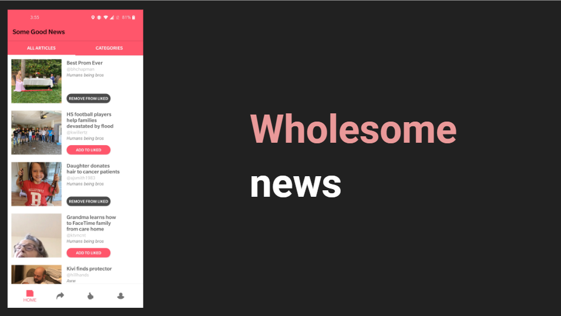
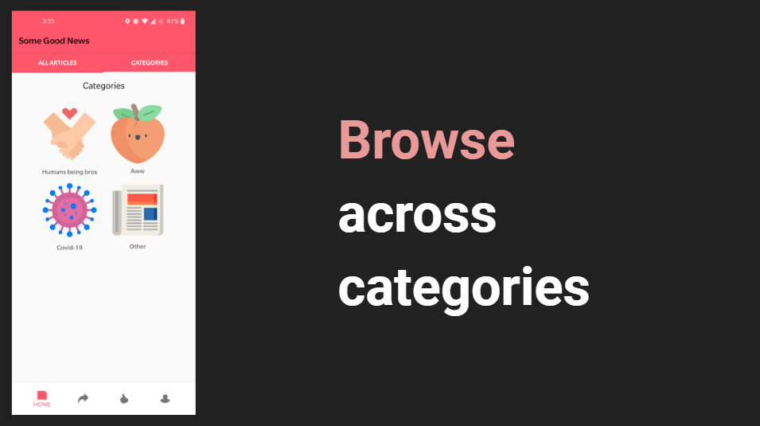

# SomeGoodNews
The whole world was thrown into an unprecedented situation.
Constantly consuming news about the pandemic can lead to excessive mental stress and fatigue.
Which is why our team was inspired by [John Krasinski's YouTube show](https://www.youtube.com/channel/UCOe_y6KKvS3PdIfb9q9pGug)
and **aims to bring you only good news from around the world.**
This is why our team was inspired by John Krasinski's YouTube show and aims to bring you only good news from around the world. This android application allows you to scroll through some wholesome news, save them for later or add your own to spread the love!:revolving_hearts:

### Download the app [here](SomeGoodNews.apk)

## Screenshots

## Features
- Scroll through some wholesome news
- Scroll through news by category
- Add your own good news
- Bookmark news that you liked

## Contributors
- :man: [@shrayarora8](https://github.com/shrayarora8)
- :man: [@ashmannsygle](https://github.com/ashmannsyngle)
- :woman: [@rajoshich](https://github.com/rajoshich)
- :woman: [@saashamoruw](https://github.com/saashamoruw)
- :purple_heart: Special shoutout to [Eric Chee](https://github.com/echeeUW) for being an amazing instructor

## Upcoming features
- Receive daily notifications about the top news
- Sort news by "wholesome-ness"
- Review process to prevent un-wholesome news
- Use View Model to clean up code
- Add responsive animations

## Frameworks used
- Firebase
- Kotlin
- Android Studio
- Picasso
- Google Material UI
